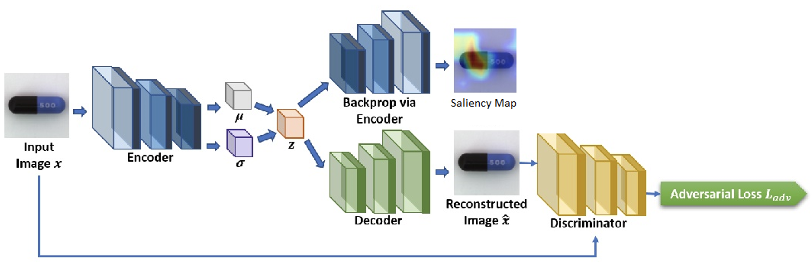
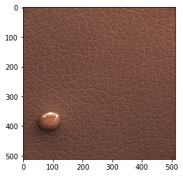
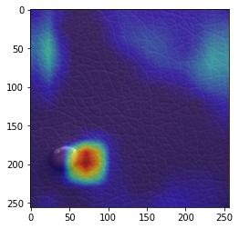
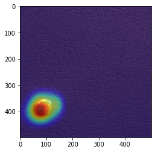

<div style="border-bottom:none;">
  <div align="center">
    
    
    <h1>Reference Algorithm for Anomaly Localization uing MVTech Dataset<h1>
      
      
  </div>
</div>

## Motivation
In applications like Medical Imaging, Traffic Surveillance and Industrial Product defects we need to detect and localize the anomalies. Few of the previous techniques depends on GMM and Deep learning techniques like VAE and GAN, thus involving anomalous training images to localize anomalies. Here in this project VAE-GAN is implemented, where VAE comprehends to localize the regions and retrives the image. Here GAN improves the image quality generated by VAE. The model is trained based on two different modes - unsupervised and semi-supervised mode. In Unsupervised mode, the model focuses on normal images so with given Anomalous image, the Convolutional Latent Variable preserves the abnormality and along with AdaCos similarity metric the model locates the anomaly. However, with Semi-supervised mode the model - trained with 1% anomalous image - prevents the model to make inference on normal region.
The final objective function is addition of VAE loss, adversarial loss and AdaCos loss.

The Project is dependent on the paper "Attention Guided Anomaly Localization in Images"

## Installation 
- `pip install mvtech_al` or 
- `git clone https://github.com/meetshrihari/Anomaly_Detection_MVTech.git`

## Run
```
python main.py --name 'VAE_GAN' --arch 'ResNet18' --dataset 'leather' --batch-size 8 --epochs 250 --learning-rate 1e-1 --min-lr 1e-3 --momentum 0.9 --weight-decay 1e-4 --learning 'semi-supervised'
```

## Structure
Project Organization
------------
    ├── Notebooks
    │   ├── mvtech_al.ipynb
    │   └── mvtech_al_leather.ipynb
    ├── references          
    │   ├── Images                   <- Folder with Images for README
    │   └── Reference papers         <- Folder with reference papers
    ├── reports                      <- Includes Powerpoint Presentation
    │   └── Final_ppt.pdf 
    ├── src                          <- Code
    │   ├── features                 <- includes utility functions
    │   │   ├── my_block.py
    │   │   ├── train.py
    │   │   └── utils.py
    │   ├── models 
    │   │   └── model.py
    │   └── main.py                  <- this file runs whole code
    ├── README.md
    ├── LICENSE 
    ├── requirements.txt
    └── setup.py
--------


## Results 
<div style="border-bottom:none;">
  <div align="center">
    <p>(a)
    </p>
    
    
    <p>The left most image is the test image, Image (center) shows the resulting localization fom Unsupervised setting and the right most image is a resultant of Semi-Supervised setting<p>      
  </div>
</div>
